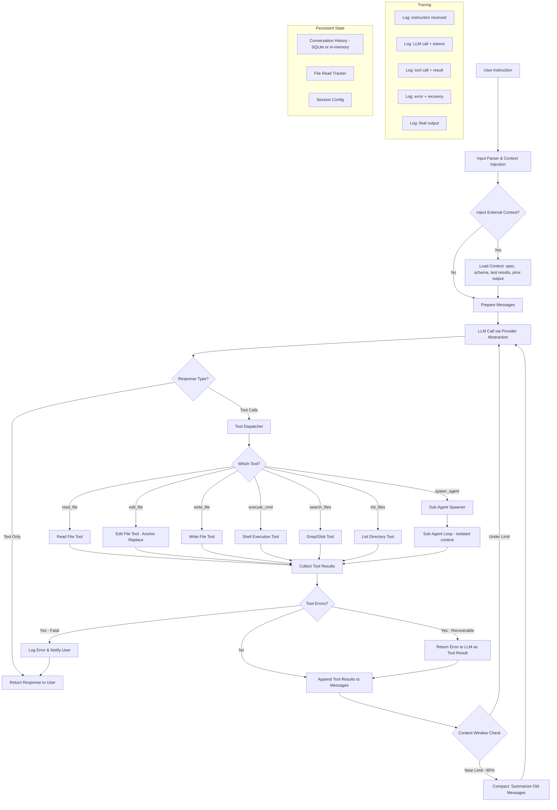
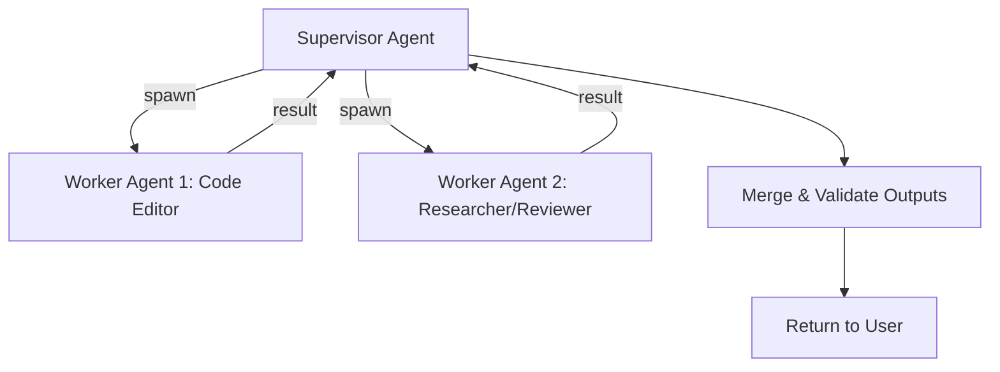

# PRESEARCH.md — Shipyard Coding Agent

> Pre-Search completed 2026-03-23. Architecture decisions locked before writing code.

---

## Phase 1: Open Source Research

### Agent 1: OpenCode (`github.com/opencode-ai/opencode`)

**Source code areas studied:** `internal/llm/agent/agent.go` (agent loop), `internal/llm/tools/edit.go` / `patch.go` / `write.go` (file editing), `internal/llm/provider/` (multi-provider system), `internal/history/` (file versioning).

**How it handles file editing:**
OpenCode offers three editing tools:
1. **Edit tool** — exact string search-and-replace (`old_string` → `new_string`). Uses `strings.Index()` to find the match, `strings.LastIndex()` to verify uniqueness. Refuses edits if the file hasn't been read first or was externally modified since last read. Returns error on zero or multiple matches.
2. **Patch tool** — custom patch format (not standard unified diff) with fuzzy context matching across three escalation levels: exact match → trimmed-right whitespace → trimmed-all whitespace. Rejects patches with fuzz score > 3. Supports multi-file atomic changes.
3. **Write tool** — full file overwrite, used for new files or complete rewrites.

**Tradeoffs:** The edit tool is simple and robust for single-point edits but requires exact string matches. The patch tool handles multi-hunk and multi-file changes but requires the LLM to produce a custom format. Both tools integrate LSP diagnostics post-edit — the agent gets immediate type-checking feedback after every change.

**Failure modes:** String not found (whitespace mismatch), multiple matches (ambiguous edit), stale read (file modified externally), patch fuzz too high. There is also a control-flow bug in edit.go where create/delete operations fall through to replace logic.

**Context management:**
- All messages persisted to SQLite, loaded in full on each turn.
- Auto-compact at 95% of context window: sends all messages to a summarization provider, replaces history with a single summary message.
- **Limitation:** Binary approach — either full history or lossy summary. No sliding window, no selective pruning of old tool results.
- Prompt caching via Anthropic's `CacheControl: "ephemeral"` on last 2 messages and last tool definition.

**Failed tool calls:**
- Soft errors (tool returns `IsError: true` with description) go back to the LLM for self-correction.
- Hard errors (Go `error`) terminate the turn.
- Permission denied cancels all remaining tool calls in the batch.
- Provider-level retry on HTTP 429/529 with exponential backoff (up to 8 attempts).
- **No agent-level retry logic** — entirely reliant on the LLM to decide whether to retry.

**What I would take from it:**
- Read-before-write guard with modification-time tracking — simple, prevents stale-data corruption.
- LSP integration after edits for immediate type-check feedback loop.
- Patch tool with fuzzy matching — pragmatic handling of whitespace drift.
- Sub-agent for search tasks with read-only tool access — reduces main agent context usage.
- Persistent shell session preserving env vars/cwd across commands.
- File history with versioning in SQLite for undo/rollback.

**What I would do differently:**
- Parallelize independent tool calls instead of sequential execution — significant latency reduction when the LLM requests multiple reads/greps in one turn.
- Replace binary context management with selective pruning: compress old tool results while retaining file paths and key outcomes.
- Add structured tool input validation against declared schemas before execution.
- Add agent-level retry logic for common failure patterns (e.g., auto-retry edit with more context on ambiguous match).

---

### Agent 2: LangChain Open SWE (`github.com/langchain-ai/open-swe`)

**Note:** The project referenced as "Open Engineer" in the PRD is now **Open SWE**, built on top of **Deep Agents** (`github.com/langchain-ai/deepagents`). Both MIT-licensed, released March 2026.

**Source code areas studied:** `agent/server.py` (agent assembly), `agent/prompt.py` (system prompt), `agent/middleware/` (error handling, message queue, safety-net), Deep Agents `middleware/filesystem.py` (file tools), `middleware/subagents.py` (synchronous subagents), `middleware/async_subagents.py` (background subagents), `middleware/summarization.py` (context compaction), `backends/utils.py` (core edit logic).

**How it handles file editing:**
Exact string replacement via `edit_file(file_path, old_string, new_string, replace_all=False)`. The implementation in `backends/utils.py`:
- Counts occurrences of `old_string` in file content.
- If 0: returns error "String not found."
- If >1 and not `replace_all`: returns error asking for more specific string.
- If 1 (or `replace_all`): performs `content.replace()`.

**Tradeoffs:** Simple and deterministic. No diff parsing complexity. But brittle to whitespace/indentation mismatches. No line-number addressing — model must reproduce exact character sequences. No multi-hunk edits in a single call.

**Failure modes:** Whitespace drift between what the model "remembers" and what's on disk. Multiple occurrences in repetitive code. Symlink attacks prevented via `O_NOFOLLOW`. Requires read-before-edit (tracked in state).

**Context management — three-layer approach:**
1. **AGENTS.md injection:** Loads project-specific context files and injects into system prompt on every turn.
2. **Auto summarization:** At ~85% context window usage, older messages are summarized by LLM and offloaded to `/conversation_history/{thread_id}.md`. Recent messages (last ~10%) are preserved. `TruncateArgsSettings` clips large tool arguments (e.g., `write_file` content) before full summarization triggers.
3. **Explicit compaction tool:** Agent can call `compact_conversation` to refresh context when switching tasks.

**Failed tool calls:**
`ToolErrorMiddleware` wraps every tool call in try/except, converts all exceptions to `ToolMessage(status="error")` with structured error data. LLM sees the failure and can self-correct. Safety-net middleware (`open_pr_if_needed`) runs after agent completion to ensure critical actions happen even if the LLM forgets.

**Multi-agent orchestration:**
- **Synchronous subagents:** Parent sends task description as `HumanMessage`, child runs to completion, parent receives final message as `ToolMessage`. State isolation: subagents get fresh message history but shared filesystem. Each subagent is a full agent graph with its own middleware stack.
- **Async subagents:** Remote background tasks via LangGraph SDK. `start_async_task` / `check_async_task` / `update_async_task` / `cancel_async_task`. Uses polling for status.
- **Parallelism:** System prompt instructs "Launch multiple agents concurrently" via multiple tool uses in a single message. LangGraph's tool node handles parallel execution.
- **Design note:** Despite blog descriptions of Manager-Planner-Programmer-Reviewer pipeline, the actual code is a single `create_deep_agent()` with flat middleware stack. Multi-agent behavior comes dynamically from the `task` tool.

**What I would take from it:**
- Middleware architecture — composable, testable, single-responsibility pieces (error handling, summarization, message injection, safety-net).
- Tool error normalization — all exceptions become structured `ToolMessage(status="error")` instead of crashes.
- Context compaction with file offload — summarize old messages, write to file, keep recent window.
- Subagent context isolation — fresh message histories with shared filesystem.
- Mid-run message injection — human-in-the-loop via message queue middleware.

**What I would do differently:**
- Add fuzzy-match fallback for file editing (Levenshtein distance) — pure exact match is too fragile.
- Implement cost-aware model routing — use cheaper/faster model for planning/search, expensive model for code generation.
- Add structured return schemas for subagents — parsing natural language from child agents is unreliable.
- Implement incremental commits during long tasks rather than single commit at end.

---

### Agent 3: Claude Code (`docs.anthropic.com/claude-code`)

**Source areas studied:** Official documentation (architecture, tools reference, permissions, sub-agents, best practices), Anthropic engineering blog posts (context engineering, building effective agents, effective harnesses), system prompt analysis.

**How it handles file editing:**
Anchor-based replacement: `Edit(file_path, old_string, new_string)`. The `old_string` must appear exactly once in the file (uniqueness requirement). Read-before-edit enforcement — the tool errors if the file hasn't been read in the current session. Also provides a Write tool for new files/complete rewrites.

**Tradeoffs:** Natural for LLMs — no line numbers to count, no diff format to learn. Uniqueness requirement forces the model to provide enough surrounding context for unambiguous edits. Atomic operations — file either fully updates or stays unchanged.

**Failure modes:** Ambiguous matches (model provides too little context), no match (whitespace mismatch or hallucinated content), file not read in session.

**Context management:**
- ~200K token context window. Auto-compaction at ~92-95% utilization.
- Compaction is model-driven summarization: preserves architectural decisions, unresolved bugs, implementation details. Discards redundant tool outputs.
- CLAUDE.md files serve as persistent project memory loaded at session start.
- Sub-agents as context isolation boundaries: expensive exploration happens in sub-agent context; only condensed summary (~1-2K tokens) returns to parent.
- `/compact <instructions>` allows user-guided compaction focus.

**Permission model:**
Tiered: read-only (no approval) → file modification (session-scoped approval) → bash commands (permanent per project+command). Modes: default, acceptEdits, plan, dontAsk, bypassPermissions. Rule evaluation: Deny → Ask → Allow.

**Sub-agent coordination:**
- Each sub-agent gets its own context window, custom system prompt, specific tool access.
- Built-in types: Explore (Haiku, read-only), Plan (read-only), General-purpose (all tools).
- **Depth limit: sub-agents cannot spawn other sub-agents.** Prevents recursive explosion.
- Foreground (blocking) vs background (concurrent) execution.
- Production sweet spot: 2-5 teammates with 5-6 tasks per teammate.

**Error handling:**
- Structured errors returned via `tool_result` with `is_error: true`.
- Git-based rollback as recovery points. Session checkpointing before every file edit.
- Test-driven iteration: run tests → observe failures → iterate on fixes → re-run tests.

**What I would take from it:**
- Anchor-based replacement (old_string/new_string) as primary edit mechanism — natural for LLMs, no formatting overhead.
- Read-before-write enforcement — prevents blind overwrites.
- Sub-agents with depth limit — prevents recursive explosion while enabling parallel work.
- Context isolation via sub-agents — most effective context management pattern.
- Flat message history — one thread, maximum debuggability.
- Regex search over vector databases — simpler, more predictable.
- Tool engineering > prompt engineering — apply "poka-yoke" (mistake-proofing) to tool design.

**What I would do differently:**
- Add fuzzy matching fallback when exact match fails — reduce retry cycles for whitespace issues.
- Implement typed tool schemas with validation (Pydantic/Zod) for richer error messages.
- Add cost-aware model routing — auto-route simple tasks to cheaper models.
- Support structured diff format as an alternative for large multi-hunk edits.

---

### File Editing Strategy Decision

**Chosen strategy: Anchor-based replacement (old_string/new_string)**

**Why:** All three agents studied converge on this approach as the primary editing mechanism. It is:
1. **Natural for LLMs** — no line numbers to count (which drift), no diff format syntax to produce correctly.
2. **Self-verifying** — the uniqueness requirement forces the model to include enough context for unambiguous matching.
3. **Simple to implement** — string search + replace, no parser dependencies.
4. **Language-agnostic** — works on any text file without AST knowledge.
5. **Battle-tested** — Claude Code, OpenCode, and Open SWE all use this as their primary edit mechanism.

**Failure modes and mitigations:**
| Failure | Detection | Recovery |
|---------|-----------|----------|
| `old_string` not found | String search returns 0 matches | Return error with file excerpt near expected location; LLM re-reads file and retries with correct text |
| Multiple matches | String search returns >1 match | Return error with match count and locations; LLM adds more surrounding context to disambiguate |
| Whitespace mismatch | Not found despite content existing | Implement fuzzy matching fallback: normalize whitespace and retry; report if fuzzy match found |
| Stale read | File modification timestamp > last read timestamp | Return error; force re-read before edit |
| File not read in session | Track read files in state | Refuse edit; instruct to read file first |
| Edit produces syntax error | Post-edit validation (linting/parsing) | Return diagnostic; LLM can fix in next turn |

**Secondary strategy: Write tool for new files and full rewrites.** No AST parsing or line-range replacement — these add complexity without proportional benefit given the anchor-based approach handles the common case well.

---

## Phase 2: Architecture Design

### 3. System Diagram



### 4. File Editing Strategy — Step by Step

1. **User requests a code change** (e.g., "Add error handling to the login function in auth.py").
2. **Agent reads the file** via `read_file` tool. The file path and read timestamp are recorded in session state.
3. **Agent identifies the target block** from file contents and formulates an `edit_file` call with `old_string` (the exact text to replace) and `new_string` (the replacement).
4. **Edit tool executes:**
   a. Verify file was read in this session (check read tracker).
   b. Verify file hasn't been modified since last read (compare modification timestamps).
   c. Search for `old_string` in file content.
   d. If not found → return error with nearby file content to help the LLM correct.
   e. If found multiple times → return error with match count and line numbers.
   f. If found exactly once → perform replacement, write file, update read tracker timestamp.
5. **Post-edit validation** (optional): run linter or type checker on the edited file. Return diagnostics with the tool result.
6. **LLM receives result** and either continues with more edits or reports completion.

**When the agent gets the location wrong:**
- The tool returns a descriptive error (not found / multiple matches) as a tool result (not a crash).
- The error includes the file excerpt around where the match was expected, helping the LLM self-correct.
- The LLM re-reads the file if needed and retries with corrected `old_string`.
- If repeated failures occur (3+ attempts on the same edit), the agent escalates to the user.

### 5. Multi-Agent Design

**Orchestration model: Supervisor with LangGraph**



- **Supervisor agent:** Receives user instruction, decomposes into subtasks, assigns to worker agents, merges results.
- **Worker agents:** Each runs in an isolated context with its own message history and a subset of tools.
  - **Code Editor worker:** Has `read_file`, `edit_file`, `write_file`, `execute_cmd`, `search_files`. Performs actual code changes.
  - **Researcher/Reviewer worker:** Has `read_file`, `search_files`, `list_files` (read-only). Gathers context, reviews code, identifies issues.
- **Communication:** Workers receive a `HumanMessage` with task description from supervisor. Workers return their final output as a text summary. Supervisor sees only summaries, not full tool call histories.
- **Output merging:** Supervisor validates that worker outputs are consistent (e.g., no conflicting edits to the same file). If conflicts detected, supervisor arbitrates by re-reading the file and choosing or combining edits.
- **Depth limit:** Workers cannot spawn sub-agents. Prevents recursive explosion.
- **Parallel execution:** Independent tasks (e.g., "edit file A" and "research library X") run concurrently via LangGraph's parallel tool node.

### 6-7. Context Injection Spec

**Types of context that can be injected:**

| Context Type | Format | Injection Point | Example |
|---|---|---|---|
| Project spec / PRD | Markdown or plain text | System prompt prefix, before first LLM call | Ship app requirements doc |
| Schema definitions | JSON Schema, SQL DDL, TypeScript types | Appended to user message | Database schema for the Ship app |
| Previous agent output | Plain text summary | Appended to user message | "Previous agent created the auth module..." |
| Test results | Structured text (pass/fail + output) | Appended as tool result after test execution | Jest/pytest output |
| File contents | Raw file text with path header | Appended to user message | Key files the agent needs to reference |
| Error logs | Plain text | Appended to user message | Stack traces from failed builds |

**Injection mechanism:**
- **At session start:** Context files/strings provided via CLI flags or API parameters are prepended to the system prompt or appended to the first user message.
- **At runtime:** Context injected via a `inject_context` tool call or a special user message format (`@context: <path>`). The agent's message queue accepts new context between LLM turns.
- **Format:** All injected context wrapped in clear delimiters:
  ```
  <injected_context type="spec" source="ship_prd.md">
  ... content ...
  </injected_context>
  ```
- **Token budget:** Injected context counts against the context window. If injection would exceed 50% of available tokens, the system warns and offers to summarize the context first.

### 8. Additional Tools

| Tool | Description |
|---|---|
| `read_file` | Read file contents with optional line range; tracks read timestamp for edit validation |
| `edit_file` | Anchor-based replacement (old_string → new_string) with uniqueness enforcement |
| `write_file` | Create new file or full overwrite; requires prior read for existing files |
| `execute_cmd` | Run shell command with timeout, output truncation, and banned-command list |
| `search_files` | Regex search across files (grep-style) with glob filtering |
| `list_files` | List directory contents with glob pattern support |
| `spawn_agent` | Launch a sub-agent with isolated context and specified tool access |
| `inject_context` | Load external context (file, URL, or inline text) into the current conversation |
| `compact_history` | Trigger context compaction — summarize old messages, keep recent window |

---

## Phase 3: Stack and Operations

### 9. Framework Choice

**Framework: LangGraph (Python) with LangChain for tool composition**

**Why:**
- **Recommended by the PRD** and well-suited for the requirements.
- **Built-in state management** — LangGraph's `StateGraph` handles message accumulation, checkpointing, and branching natively.
- **Multi-agent support** — supervisor/worker patterns are first-class via subgraph composition and parallel tool nodes.
- **LangSmith tracing** — automatic observability once `LANGSMITH_API_KEY` is set. Every LLM call, tool execution, and state transition is traced without custom instrumentation.
- **Middleware-friendly** — pre/post hooks on nodes enable clean separation of concerns (error handling, context injection, compaction).

**LLM: Claude (via Anthropic SDK), abstracted behind a provider interface**

The LLM integration will use an abstraction layer so Claude can be easily swapped:

```python
# Provider interface — swap implementations to change LLM
class LLMProvider(Protocol):
    async def chat(self, messages: list[Message], tools: list[Tool]) -> Response: ...
    def get_model_name(self) -> str: ...
    def get_context_window_size(self) -> int: ...
    def get_cost_per_token(self) -> tuple[float, float]: ...  # (input, output)

class AnthropicProvider(LLMProvider):
    """Claude via Anthropic SDK — primary provider."""
    ...

class OpenAIProvider(LLMProvider):
    """OpenAI GPT models — drop-in replacement."""
    ...
```

This satisfies the PRD requirement ("Anthropic SDK required") while making it trivial to add OpenAI, Gemini, or local model providers later. The provider interface is the only place LLM-specific logic lives.

**Backend: Python / FastAPI** — aligns with LangGraph's Python ecosystem. FastAPI provides the HTTP layer for the persistent agent server.

### 10. Persistent Loop Design

**Where it runs:** Local Python process (FastAPI server) for MVP. Deployed to cloud for Final Submission.

**How it stays alive:**
- FastAPI server runs continuously, accepting HTTP requests at endpoints like `POST /instruction` and `GET /status`.
- The agent loop runs as an async task within the server process. New instructions are queued and processed sequentially (or in parallel for multi-agent tasks).
- **Session persistence:** Conversation history stored in SQLite. On restart, the agent can resume from the last checkpoint.
- **Health check:** Background task pings the agent loop every 30s. If unresponsive, logs error and restarts the loop.
- **Graceful shutdown:** On SIGTERM, completes current tool execution, saves state, then exits.

**For MVP:** `uvicorn` running locally. No containerization needed.
**For Final Submission:** Dockerized, deployed to cloud (Vercel/Railway/Fly.io).

### 11. Token Budget

**Per-invocation budget:**

| Component | Token Allocation |
|---|---|
| System prompt + injected context | ~10,000 tokens |
| Conversation history | ~120,000 tokens |
| Tool definitions | ~5,000 tokens |
| Current turn (LLM output + tool results) | ~50,000 tokens |
| **Total context window** | **~200,000 tokens** (Claude Sonnet) |

**Cost cliffs:**
- **Compaction trigger:** At ~170K tokens (~85%), auto-summarize old messages. This is lossy — fine-grained details from early turns are compressed.
- **Large file reads:** A single 2,000-line file can consume ~15-20K tokens. Multiple large file reads in one session can rapidly fill context.
- **Multi-agent overhead:** Each sub-agent gets its own context window, so parallel agents multiply token usage linearly.

**Cost per invocation (Claude Sonnet 4):**
- Input: $3/MTok, Output: $15/MTok
- Typical turn: ~8K input + ~2K output = $0.024 + $0.030 = ~$0.054 per turn
- Typical task (10-15 turns): ~$0.50–$0.80
- With prompt caching: ~30-50% reduction on cached input tokens

**Cost per invocation (Claude Haiku 4.5 — for sub-agents):**
- Input: $0.80/MTok, Output: $4/MTok
- Typical sub-agent task: ~$0.05–$0.10

### 12. Bad Edit Recovery

**Detection:**
1. **Immediate:** Edit tool returns error (not found, multiple matches, stale file) — no file modification occurs.
2. **Post-edit:** Run linter/type-checker on edited file. If new errors introduced, return diagnostics to LLM.
3. **Test-driven:** After a logical set of edits, run relevant tests. Failures indicate bad edits.
4. **User feedback:** User observes incorrect behavior and provides correction.

**Recovery:**
1. **LLM self-correction:** On tool error, the LLM receives the error message and retries with corrected parameters. This handles ~80% of cases (ambiguous matches, whitespace issues).
2. **File rollback:** Maintain pre-edit file snapshots. If post-edit validation fails and the LLM cannot fix it in 3 attempts, offer to roll back to the pre-edit version.
3. **Git-based recovery:** For multi-file changes, use git commits as checkpoints. If a set of edits produces a broken state, `git checkout` the last working commit.
4. **Escalation:** After 3 failed attempts at the same edit, surface the issue to the user with full context (what was attempted, what failed, current file state).

### 13. Tracing / Observability

**What gets logged (using LangSmith):**

Every agent run produces a trace with the following structure:

```
Trace: instruction_123
├── [USER_INPUT] "Add error handling to login function in auth.py"
├── [CONTEXT_INJECTION] Loaded: ship_spec.md (2,340 tokens)
├── [LLM_CALL] claude-sonnet-4 | input: 12,450 tok | output: 890 tok | latency: 2.3s
│   └── [TOOL_CALLS]
│       ├── read_file("src/auth.py") → 156 lines, 4,200 tok | 45ms
│       └── search_files("def login", "src/**/*.py") → 1 match | 120ms
├── [LLM_CALL] claude-sonnet-4 | input: 17,540 tok | output: 1,200 tok | latency: 3.1s
│   └── [TOOL_CALLS]
│       └── edit_file("src/auth.py", old="def login(...)...", new="def login(...)...try/except...")
│           → SUCCESS | diff: +12 lines, -3 lines | 30ms
├── [LLM_CALL] claude-sonnet-4 | input: 18,770 tok | output: 340 tok | latency: 1.8s
│   └── [TOOL_CALLS]
│       └── execute_cmd("python -m pytest tests/test_auth.py -v") → PASS (3/3) | 4.2s
├── [LLM_CALL] claude-sonnet-4 | input: 19,450 tok | output: 180 tok | latency: 1.2s
│   └── [TEXT] "Done. Added try/except to login() with specific exception handling..."
├── [METRICS] total_turns: 4 | total_tokens: 70,280 | total_cost: $0.22 | duration: 15.6s
└── [STATUS] COMPLETED
```

**Error branch example:**
```
├── [LLM_CALL] ...
│   └── [TOOL_CALLS]
│       └── edit_file("src/auth.py", old="def logn(...)...", new="...")
│           → ERROR: old_string not found in file | 15ms
├── [LLM_CALL] ... (self-correction)
│   └── [TOOL_CALLS]
│       └── read_file("src/auth.py", lines="20-40") → re-read target area | 30ms
├── [LLM_CALL] ... (retry with correct string)
│   └── [TOOL_CALLS]
│       └── edit_file("src/auth.py", old="def login(...)...", new="...") → SUCCESS
```

**Trace storage:** LangSmith (cloud) for shareable trace links. Local SQLite fallback for offline development. Every trace includes: instruction, all LLM calls with token counts, all tool calls with inputs/outputs/duration, errors with recovery paths, final output, aggregate metrics (cost, latency, turns).
